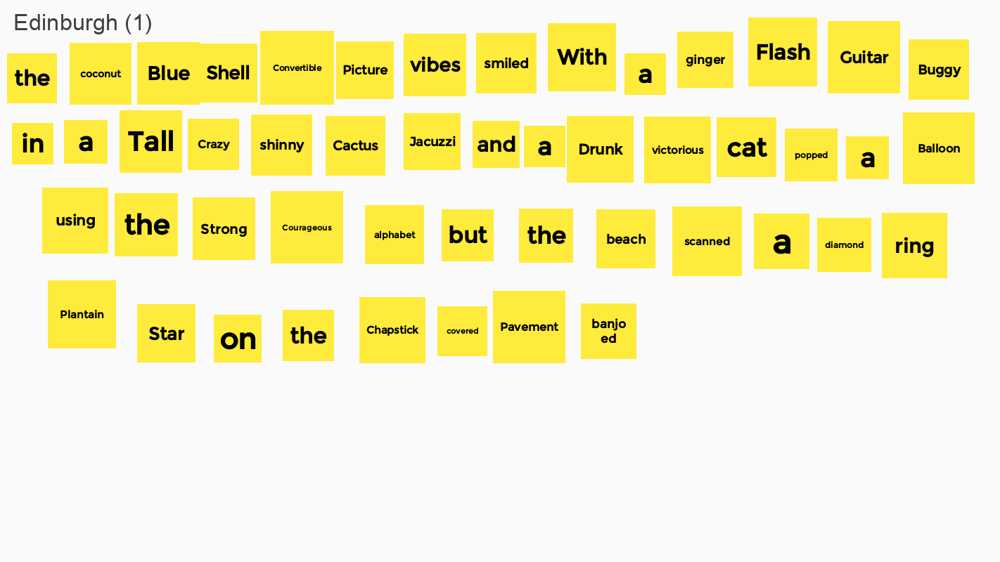
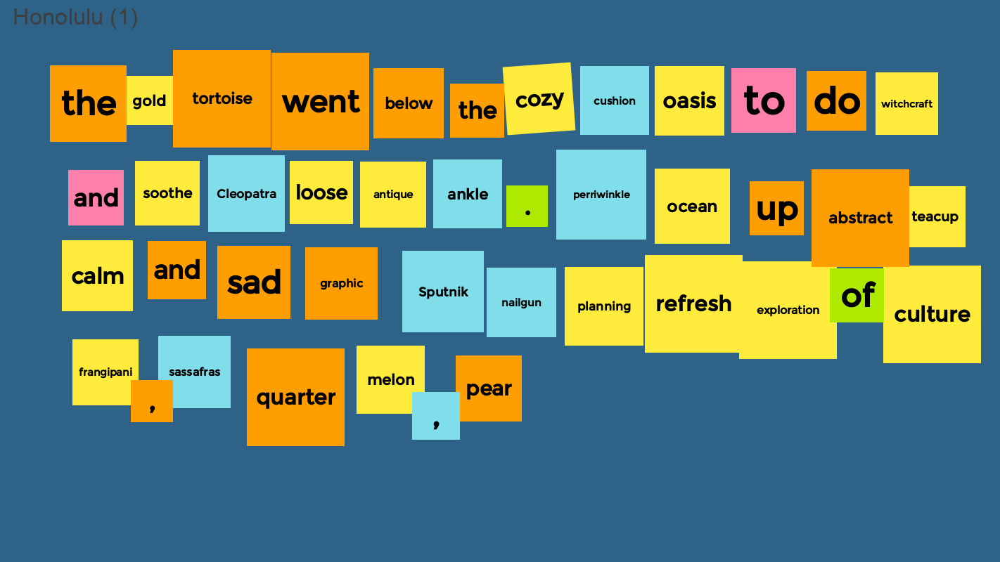
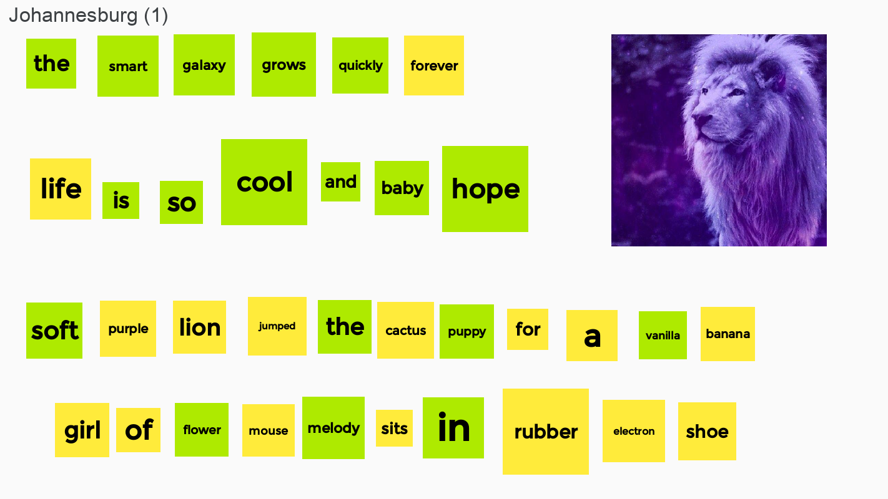
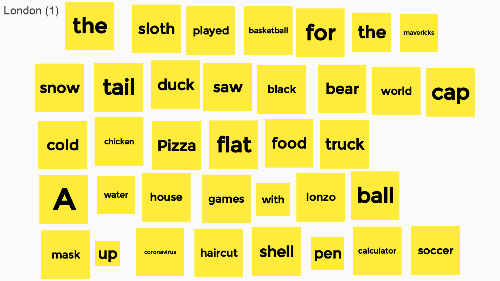
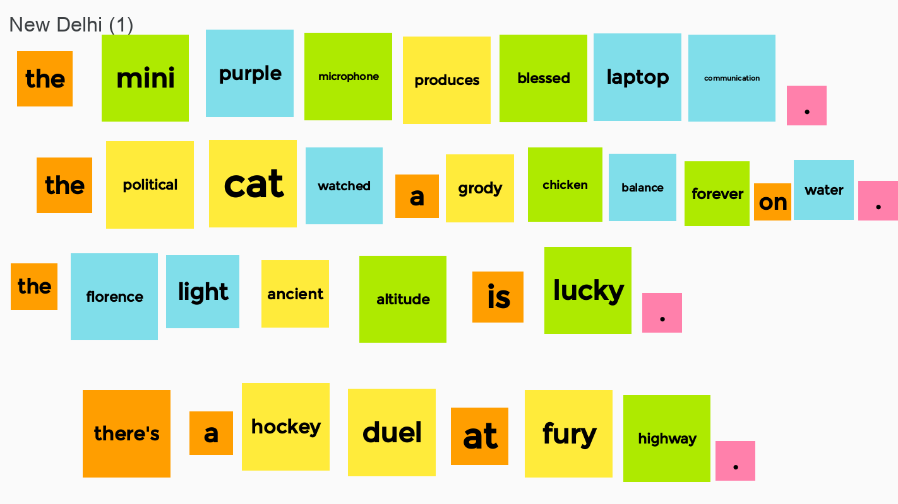
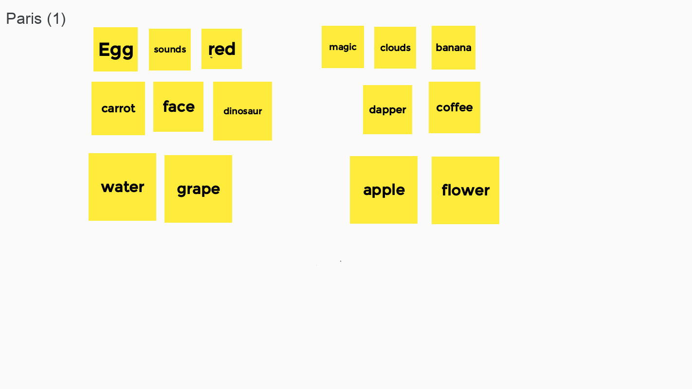
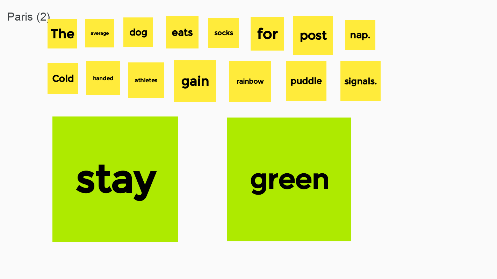
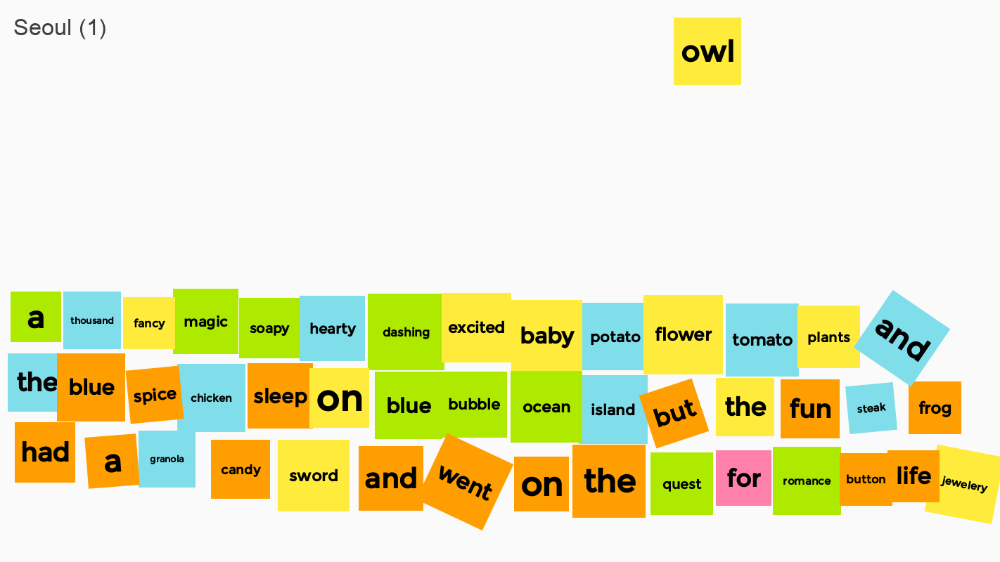
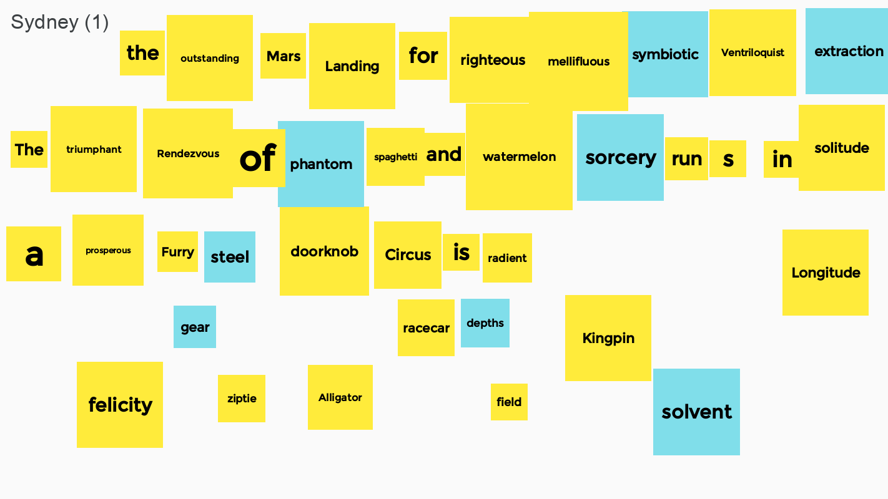

---
# Feel free to add content and custom Front Matter to this file.
# To modify the layout, see https://jekyllrb.com/docs/themes/#overriding-theme-defaults

layout: course-TEC
---

# <a name="gallery">Gallery</a>

 

Once upon a time I went up a tree very quickly to
hippo.  I decided that the hippo was to thick and fat to fit in its
convertible.

 

<!-- 
 -->
<!-- <iframe src="https://albumizr.com/a/-Spb" scrolling="no" frameborder="0" allowfullscreen width="700" height="400"></iframe> -->
<!-- 
 -->

<!--  -->
<!--  -->
<!--  -->
<!--  -->
<!--  -->
<!--  -->
<!--  -->
<!--  -->
<!--  -->

# <a name="description">Overview</a>

{{ site.description }}

## <a name="goals">Learning Goals</a>

* Comprehend and appreciate a set of complex issues relevant to being
  engaged citizens.
* Make connections between the evidence and methods from two distinct
  disciplines in order to formulate arguments about engaged citizenship.
* Express those arguments clearly in writing and discussion.
* Engage in and reflect on experiential learning that connects
  directly to the classroom experience, preparing you for vibrant
  Odyssey experiences later in your Hendrix career.

## <a name="resources">Resources</a>



# Course content

## <a name="calendar">Calendar</a>

If you are in Section 1, you should only look at the
**left** column of the calendar. If you are in section 2, look only
at the <b>right</b> column.  The color of each date tells you whether
your section will be taught by Prof.
Gill, Dr. Yorgey, or whether we
will all meet together.



## <a name="grading">Grading Policies</a>

Grading for this course uses a cumulative, points-based system.  Each
assignment will be worth a certain number of points; points earned on
all assignments will be added to determine the total points earned in
the course.

* Two writing assignments: 100 points each (200 total)
* Two projects in Unit 1: 100 points each (200 total)
* One project in Unit 2: 200 points
* Two projects in Unit 3: 150 points each (300 total)
* Class participation: 200 points

Your final letter grade will then be determined using the
following scale, out of a possible 1100 points:

| Points   | Grade |
|:--------:|:-----:|
| 950-1100 | A     |
| 850-949  | B     |
| 750-849  | C     |
| 650-749  | D     |
| < 650    | F     |

### <a name="rolling">Rolling submissions</a>

Projects and writing assignments will be accepted and graded on a
**rolling** basis:

* Each assignment has a deadline which is the absolute last day on
  which you may submit it.
* However, you are strongly encouraged to turn in the assignment any
  time **before** the deadline.  If you are really on the ball you
  could even do it and turn it in the day after it is assigned!
* We will return the submitted assignment
  to you, with a grade and feedback, **within two working days** (M-F)
  of when you submit it.
* If you wish, you may then revise the assignment, taking our feedback
  into account, and resubmit it (as long as it is still before the
  deadline). In fact, you can repeat this cycle several times if you
  start early enough!
* Your grade for the assignment will simply be the grade you earn on
  your **last** submission before the deadline.

Note that when making use of rolling submissions you don't have to
turn in a completed assignment---if you have completed only part of an
assignment and want some feedback you are welcome to turn it in as-is!

## <a name="writing">Writing Assignments</a>

You will complete two writing assignments in the course.  You will be
given several weeks to complete each assignment, in which you will
draw on class discussions and assignments to explore a particular set
of questions.

For each writing assignment, we will have a "workshop
day" where you will give and receive peer feedback on a draft. You are
also welcome and encouraged to make use of [rolling
submission](#rolling) to get feedback from us as well.

| Assignment                                                 | Points | Due                    |
|------------------------------------------------------------|:------:|------------------------|
| [Writing prompt 1]({{site.baseurl}}/writing/writing1.html) | 100    | Sep 23 (draft) / Oct 5 |
| [Writing prompt 2]({{site.baseurl}}/writing/writing2.html) | 100    | Nov 6 (draft) / Nov 23 |

## <a name="projects">Projects</a>

You will complete **five** creative projects in this course: two for
Dr. Yorgey, two for Prof. Gill, and one combined project.

| Project                                                                         | Points | Due    |
|---------------------------------------------------------------------------------|:------:|--------|
| [Abstracted Collage]({{site.baseurl}}/projects/collage.html)                    | 100    | Sep 28 |
| [Generative Drawing]({{site.baseurl}}/projects/generativedrawing.html)          | 100    | Sep 28 |
| [Digital vs. Analog after Sol LeWitt]({{site.baseurl}}/projects/sollewitt.html) | 200    | Nov 9  |
| [Artistic Intervention]({{site.baseurl}}/projects/intervention.html)            | 150    | Dec 4  |
| [Context Free Art Remix]({{site.baseurl}}/projects/remix.html)                  | 150    | Dec 4  |

# Expectations and Resources

## <a name="attendance">Attendance</a>

Our class will meet synchronously every Monday, Wednesday, and Friday
from 12:10-1:00 in Microsoft Teams.  If you wish to request approval
to participate in class asynchronously, you must [apply to the
Provost's
office](https://login.microsoftonline.com/common/oauth2/authorize?response_mode=form_post&response_type=id_token+code&scope=openid&msafed=0&nonce=56fa5b48-8fb9-4a55-a826-1bf84679d48c.637322495663802544&state=https%3a%2f%2fforms.office.com%2fPages%2fResponsePage.aspx%3fid%3djMH2DNLQP0qD0GY9Ygpj07hmgJo2lQ5PkyQfFaiYfP9UM0ZSUDdPMzhIMlBWQjRUN1lJR0YzMjdSRC4u&client_id=c9a559d2-7aab-4f13-a6ed-e7e9c52aec87&redirect_uri=https%3a%2f%2fforms.office.com%2fauth%2fsignin&sso_nonce=AQABAAAAAAAGV_bv21oQQ4ROqh0_1-tApffDewQSweQXPnEpHtDRaCKzA7chGGXuH867o44RjhphBbCI7fpqjH6mFYXA86vlOVVsMV4SRkVXWOdyYvYpYCAA&client-request-id=4c50a91c-25bd-48a1-afef-da1e5039416e&mscrid=4c50a91c-25bd-48a1-afef-da1e5039416e).

Attendance is required, and you will receive points for attendance and
active participation in group activites.  If you know you will need to
be absent on a particular day, please let us know ahead of time by
sending an email or a message in Teams.

The default mode of attendance should be with your microphone muted
and video on.  We recognize that you may have good reasons (either
technical or personal) for turning off your video, and will not ask
questions.  However, if you are able, we highly encourage you to keep
your video on for the most part, since it contributes substantially to
everyone's sense of engagement and connection (not least of all our
own!).

With all that said, it's easy for connection issues to occasionally
prevent you from attending despite your best intentions.  If this
happens just let us know!  We certainly do not want to penalize you
for events outside your control.

## <a name="writing_center">Writing Center</a>

The Writing Center continues to support the Hendrix community
online. Contact us to work on your projects with a peer Writing
Associate. We can assist you in all fields and genres, from the
brainstorming stage to revising a full draft. You can schedule an
appointment in advance or for the moment of booking. Simply visit
[www.hendrix.edu/writingcenter/](http://www.hendrix.edu/writingcenter/),
click on "Book an Appointment," and follow the instructions. For all
services, you will have two options: *synchronous assistance* (through
a Teams video or audio chat) and *asynchronous assistance* (where you
email us your work and we respond with our feedback). Choose the
option that best suits you! Please contact
[pruneda@hendrix.edu](mailto:pruneda@hendrix.edu) for more
information.

## <a name="library">Library </a>

Bailey Library's mission is to collaborate and empower all members of
our community so that they become their best selves, cherish the scope
of human knowledge, and positively contribute to the world. Whether
face-to-face or remote, librarians are happy to help locate quality
resources supporting research and classroom work and to assist with
the critical evaluation of academic information. Librarians and
Library Associates provide individual research assistance by
appointment and video chat or by email. The library building is open
Monday-Friday 8-5pm, but access to the library's online resources is
available 24/7. You can visit the library's website at
https://www.hendrix.edu/baileylibrary/ for more information, to book
an appointment, and to access the library's Discovery search, Class
Guides, and databases.

## <a name="accommodations">Learning Accommodations</a>

If you have a documented disability or some other reason that you
cannot meet the above expectations, and/or your learning would be best
served by a modification to the usual course policies, we would be
happy to work with you—please get in touch (via Teams or email)! The
course policies are just a means to an end; we don’t care about the
policies per se but we do care about you and your learning.

*It is the policy of Hendrix College to accommodate students with
disabilities, pursuant to federal and state law.  Any student who
needs accommodation in relation to a recognized disability should
inform the instructor at the beginning of the course.  Students should
also contact Julie Brown in the Office of Academic Success (505.2954;
[brownj@hendrix.edu](mailto:brownj@hendrix.edu)) to begin the
accommodation process.*

## <a name="health">Physical and Mental Health</a>

If you are struggling with your health in a way that makes it
difficult for you to fulfill your responsibilities in the course,
please let us know!  We would love to work with you to come up with
reasonable and realistic accommodations to help you succeed in the
course.  There are also several resources available to all Hendrix
students, even remotely:

* The [Hendrix Medical
  Clinic](https://www.conwayregional.org/locations/clinics/hendrix-medical-clinic)
  offers both in-person and tele-health appointments; Hendrix students
  get three free appointments per semester.

* The [Hendrix Office of Counseling
  Services](https://www.hendrix.edu/counseling/) also offers free
  remote appointments, and can help with a host of issues such as
  stress, anxiety, depression, grief, or relationship difficulties.
  Call 501-450-1448 to make an appointment.
