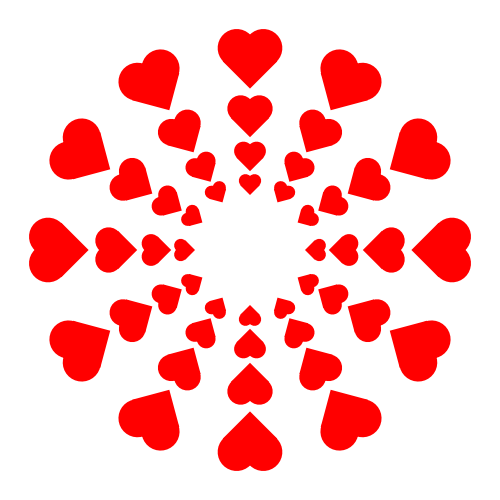

## Practice

First, with your partner(s), decide who will be the "driver" first
(you will all get a turn eventually).  The driver should share their
screen and open the Context Free Art app.

Working as a group, write code to recreate this image as
closely as possible:

It does not matter if it is perfect but you should try to get it as
close as you can.

Some hints:

* To make a heart, overlap two circles and a square.
* The example code Dr. Yorgey wrote in class [can be found in Teams](https://teams.microsoft.com/l/message/19:79022d165f104dff8dc3f2dc33a34f8c@thread.tacv2/1598897033276?tenantId=0cf6c18c-d0d2-4a3f-83d0-663d620a63d3&groupId=0fbacc55-c3c7-4d1c-983d-f4949a810a12&parentMessageId=1598893478292&teamName=TEC%3A%20Creativity%20(Section%201)&channelName=General&createdTime=1598897033276).
* For a reminder on how to use colors, see the page on [shape
  adjustments](https://github.com/MtnViewJohn/context-free/wiki/Shape-Adjustments).
  Remember to set the saturation and brightness to something other
  than zero. (*e.g.* `[... sat 1 b 1 ...]`)
* Dr. Yorgey will be visiting your group periodically to see how
  you're coming along.  If you get stuck or run into questions, write
  them down and ask the next time Dr. Yorgey visits.  In the meantime,
  see if you can make progress in some other way.

## Exploration

Now, **switch drivers**: have someone else open the Context Free app
and share their screen. If you wish, the first driver can send the
`.cfdg` file with your code from the practice exercise so the second
driver doesn't have to start from scratch.

Working together, either starting from the practice exercise code or
from a blank file, explore Context Free Art and create something!

If you are in a group of three, make sure to switch again at some
point so the third person has a chance to be the driver as well.
