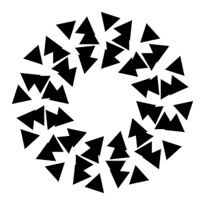
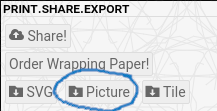

## Description

You will create generative visual art using three different digital
tools: [recursivedrawing.com](http://recursivedrawing.com), [EscherSketch](http://eschersket.ch/), and [Context Free Art](https://www.contextfreeart.org/).

Project due **{{page.due}} at {{page.duetime}}**.

Guidelines
----------

- Explore the three digital tools.  Have fun, play, don't be afraid to
  try things or to make mistakes!

    - Dr. Yorgey will demonstrate
      [recursivedrawing.com](http://recursivedrawing.com) in class.
      Remember that to save your images you will need to [take a
      screenshot](https://www.pcmag.com/news/how-to-take-a-screenshot-on-any-device).

    - Dr. Yorgey will also introduce [Context Free
      Art](https://www.contextfreeart.org/) in class.

    - For [EscherSketch](http://eschersket.ch/), you are on your own,
      and this is intentional!  You will probably be confused and
      overwhelmed by the interface, and you probably won't figure out
      what all the options do.  That's OK!  Take a deep breath, play,
      experiment, and be prepared for some surprising results.

        - Note that to save images from EscherSketch, use the controls
          in the very bottom left corner, which look like this:

          

          Click the "Picture" button to save the current image as a
          `.png` file.

- You should create at least *three different images* using *each
  tool*, for a total of nine images.  (You can submit more than nine
  images if you wish.)

- The images should be substantially different, that is, you should
  not submit images which are just slight variations of each other.

- Your images must exhibit some **complexity** and/or
  **generativity**.  A good rule of thumb is that your images should
  be such that they would be very difficult or tedious to produce by
  hand.  For example, you should not use <tt>recursivedrawing.com</tt>
  to make an image consisting of just a square next to a circle,
  because you could easily have drawn that by hand.

- Note, however, that your images do not necessarily have to be
  __complicated__; simple images can still be generative.  As one example,
  an image consisting of 300 parallel horizontal lines is very simple,
  but would be tedious to draw by hand.

Reflection
----------

After creating your images, you should write 1-2 paragraphs
reflecting on your process of creativity and discovery.  For example,
you might consider questions such as:

  - To what extent did you feel that you were in control of the
    process?  Did it make you feel excited? Anxious? Curious?
    Contemplative? etc.?
  - Which part of the process surprised you?  What went better than
    you expected, or worse than you expected?
  - Which image is your favorite, and why?

Your reflection does **not** need to answer all the above questions,
and you could also answer other, related questions instead.  These
are just example prompts to get you thinking.  You will not be graded
on things like grammar, punctuation, etc. (although writing well is
always a goal worth striving for); I simply want to see evidence of
thoughtful reflection.

Submission
----------

You should turn in:

- Your **images**: `.png` or `.jpg` files (or something similar), at least three
  for each tool.
- For the images generated using Context Free Art, you should also
  submit the Context Free Art **programs** (`.cfdg` files) you wrote
  to generate them.
- Your **reflection, as a PDF file**.
    - Most text editors (Word, Pages,
      etc.) support an option to "Export to PDF", usually in the File
      menu.  If you need help with this step, just ask!

You can submit your project [via this DropBox
link](https://www.dropbox.com/request/kbemWssiaMbLG0OgMygG).

Remember to take advantage of [rolling submissions](../#rolling): turn
in your project any time before the deadline to get feedback, revise,
and resubmit!
